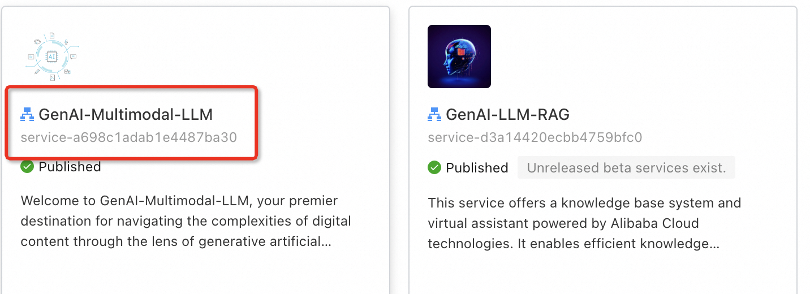
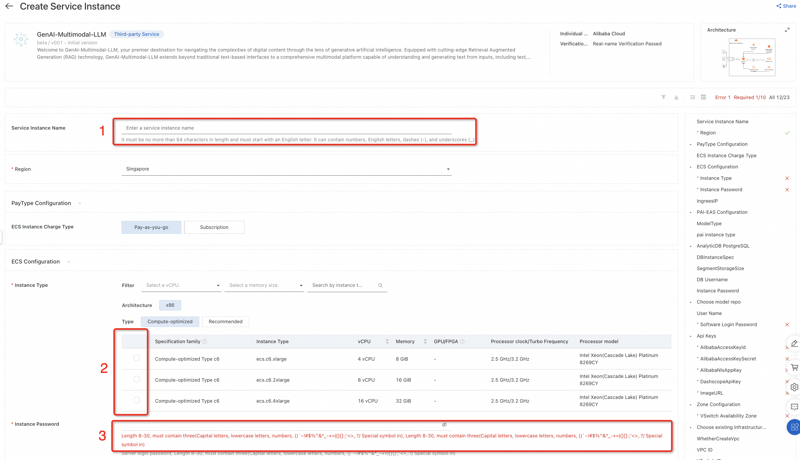
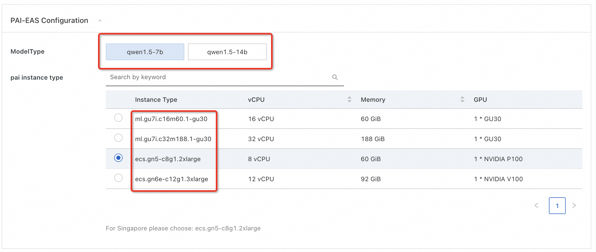
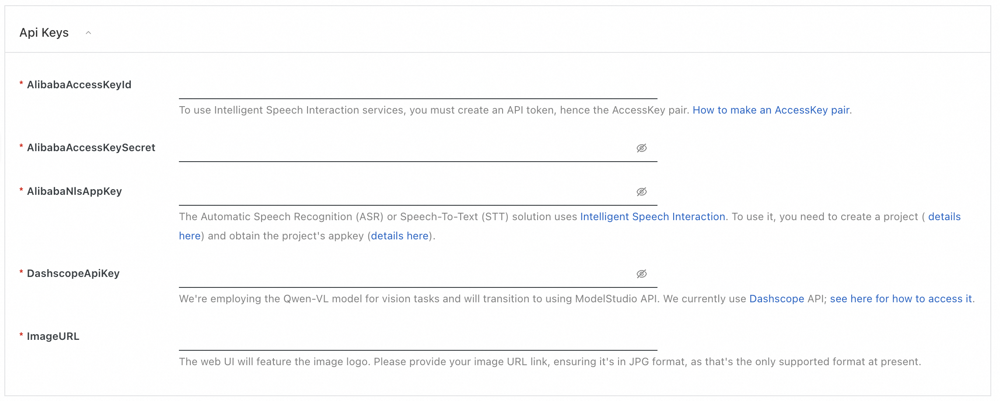
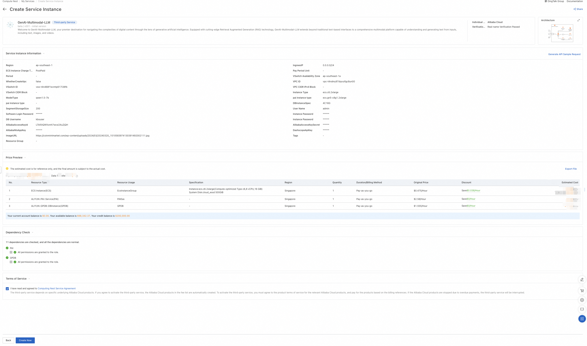
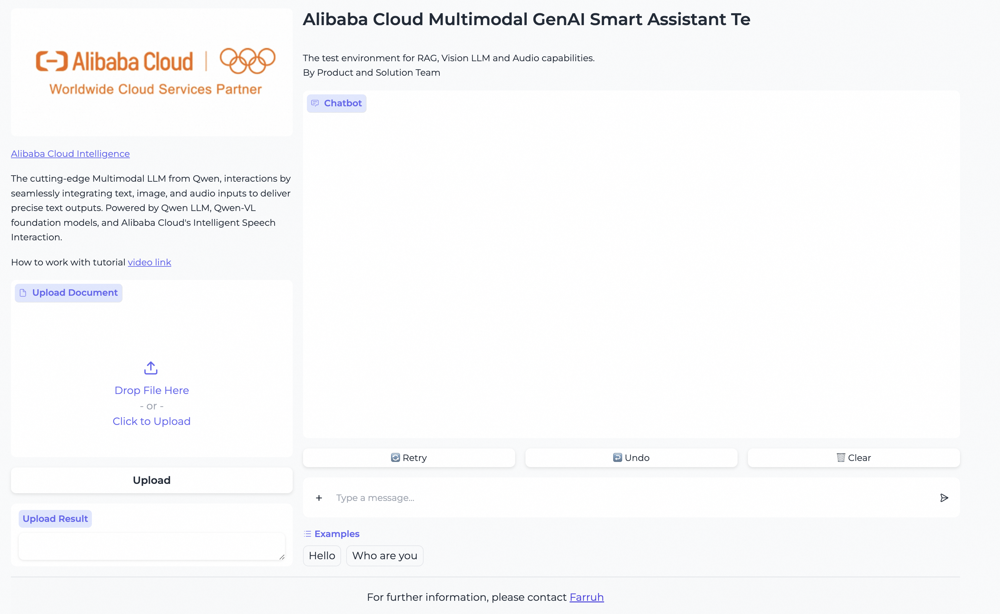
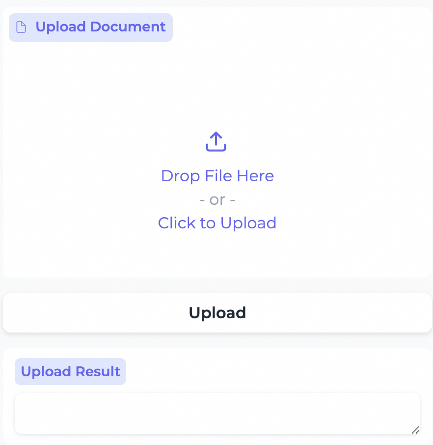
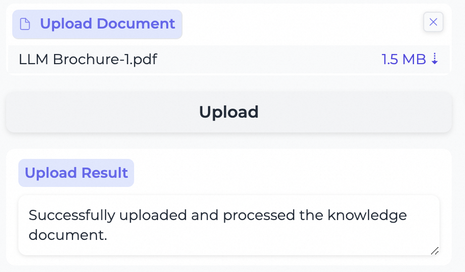
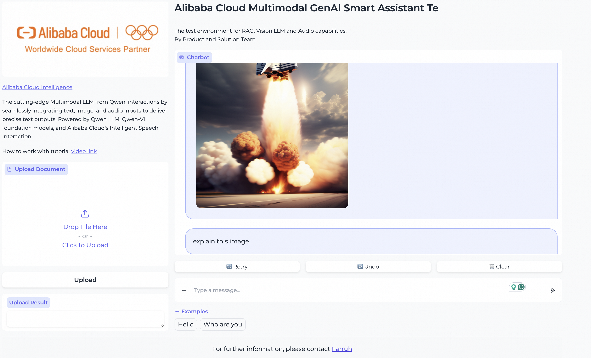
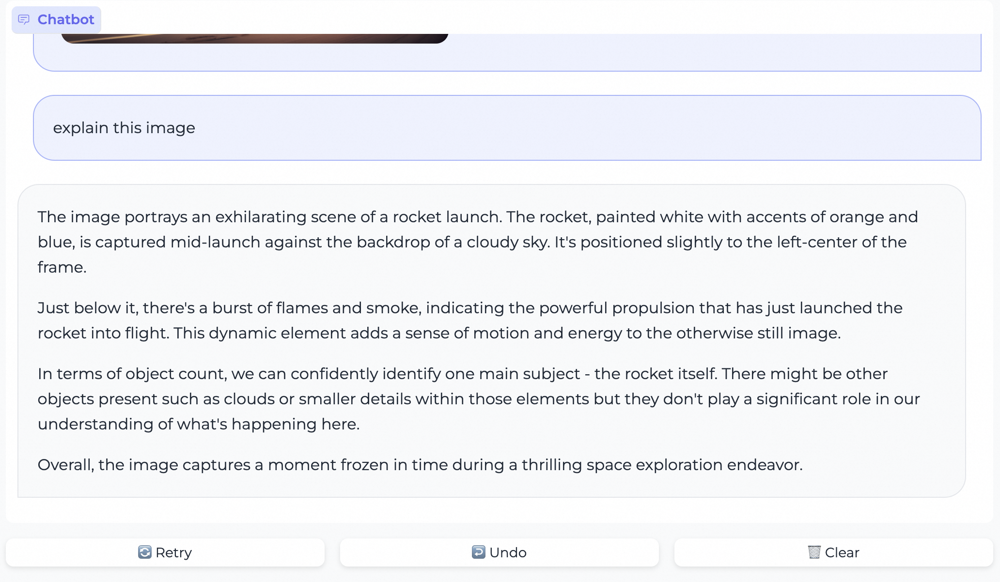

# Step-by-Step Guide for Setting Up a GenAI-Multimodal-LLM on Compute Nest

## Introduction

This tutorial aims to guide you through the establishment of a Multimodal Smart GenAI Assistant Service, leveraging the Qwen LLM and Qwen-VL others on the Compute Nest platform, and integrating Alibaba Cloud's Platform for AI—Elastic Algorithm Service (PAI-EAS), AnalyticDB for PostgreSQL, Intelligent Speech interaction, and ECS for webui.

## Prerequisites

- Active Alibaba Cloud account
- Familiarity with AI models and cloud services

## Step 1: Alibaba Cloud Account Preparation

If you haven't already, ensure your registration on Alibaba Cloud by signing up [here](https://www.alibabacloud.com/).

## Step 2: Starting with Compute Nest

1. Log into your Alibaba Cloud account.
2. Navigate to Compute Nest and search for "Multimodal Smart GenAI Assistant Service" or the GenAI-Multimodal-LLM. Click "Official Use" to proceed.

## Step 3: Configuring Your Service Instance

You need to: 

1. Assign a name to your service instance.
2. Select the ECS (Elastic Computing Services) settings, opting for an ecs.c6.2xlarge for better performance.
3. Establish a secure password for accessing the instance.

## Step 4: Launching a PAI-EAS Service with LLM

To deploy your LLM on PAI-EAS:

1. choose an LLM model that fits your requirements from the available options.
2. Select the instance type suitable for your needs.
3. Deploy your model on PAI-EAS, ensuring you save the API endpoint information for future reference.

## Step 5: Establishing AnalyticDB for PostgreSQL

Configure your vector storage by:

1. Selecting an instance specification for AnalyticDB for PostgreSQL based on the anticipated document load.
2. Defining the size of the document storage.
3. Setting "kbsuser" as the default DB username (or choosing another). Avoid using symbols like "@" in passwords.

## Step 6: Initialization of Intelligent Speech Interaction

Navigate to the Intelligent Speech Interaction service within your Alibaba Cloud console.
Add a configuration by entering your Alibaba Cloud account:
- AccessKey pair: AccessKey and SecretKey.  <a href="https://www.alibabacloud.com/help/en/ram/user-guide/create-an-accesskey-pair">How to get an AccessKey pair</a>
- API token. The Automatic Speech Recognition (ASR) or Speech-To-Text (STT) solution uses <a href= "https://www.alibabacloud.com/en/product/intelligent-speech-interaction">Intelligent Speech Interaction</a>. To use it, you need to create a project ( <a href= "https://www.alibabacloud.com/help/en/isi/create-a-project#2572188">details here</a>) and obtain the project's appkey (<a href= "https://www.alibabacloud.com/help/en/isi/getting-started/obtain-an-access-token#topic-2572193">details here</a>).
   

## Step 7: Incorporating Modelstudio or Dashscope API

Obtain the Model Studio or Dashscope API endpoint for the Qwen-VL model from the Alibaba Cloud console.
Integrate the API endpoint into your service to call the Qwen-VL model as part of your assistant's capabilities. 

The Qwen-VL model transitioned to using ModelStudio API. We currently use <a href="https://dashscope.aliyun.com/"> Dashscope </a> API; <a href="https://help.aliyun.com/zh/dashscope/support/faq?disableWebsiteRedirect=true">see here for how to access it</a>.

## Step 8: Network and WebUI Configuration

1. Assign a username for web UI access, with "admin" as the default option.
2. Create a strong password for enhanced security.

3. For VPC configuration, either select an existing VPC or furnish new VPC details if required.
4. Proceed by clicking "Next: Confirm Order."

## Step 9: Deploying Your GenAI Assistant Service

Please review all settings, agree to the "Terms of Service," and deploy your service by selecting "Create Now." Please be patient as the service initiates.

## Utilizing the GenAI Assistant Service

Web UI is tailored to help you upload and manage various document types, images, and audio files and easily extract insights and answers from your content through an interactive AI assistant. Follow this guide to navigate our Web UI and make the most out of your experience.

### Uploading Documents
Our platform supports various document types as a knowledge base, including DOCX, PDF, XLSX, and TXT. Here's how to upload documents and get started:

1. **Locate the Upload Section:** Below the introduction, on the left side of the web UI, you should find an upload interface: "Upload Document" designated explicitly for documents.

2. **Select Your File:** Click on the "Click to Upload" button or drag and drop your document directly into the highlighted area.
3. **Wait for Completion:** The system will now upload the document. A progress bar or an icon will indicate the upload status. Wait until the document is completely uploaded.
4. **Confirmation:** Once uploaded, a confirmation message may appear, or the file may be listed in your knowledge base.

### Asking Questions
After uploading the document, you can interact with the GenAI Smart Assistant:

1. **Navigate to the assistant:** Find the input field or section where you can enter your questions.
2. **Type Your Question:** Enter any question related to the uploaded document. For example, "What is the main topic of the third chapter in the uploaded text?"
3. **Submit:** Press the">" button or hit Enter to submit your question.
4. **View the Answer:** The assistant will process your question and provide an answer, usually displayed below the input box.

### Uploading Images
You can talk with image by attaching a picture and ask questions about them:

1. **Find the Image Upload:** Locate the section for text input and find button "+".

2. **Upload Your Image:** Click on the "+" button and attach your image to the text (the question related data on the image). Acceptable formats typically include JPEG, PNG, and others.

3. **Ask Questions:** Once your image is uploaded, use the assistant's input field to ask questions about its content or context. Press the">" button or hit Enter to submit it.

### Uploading Audio Files
Our platform allows you to upload audio files and inquire about the contained knowledge:

1. **Audio Upload Section:** Locate the section for text input and find button "+".

2. **Select and Upload Audio:** Choose your audio file by clicking "Choose File." Supported formats include MP3, WAV, and more.
3. **Ask Related Questions:** After uploading your audio file, press the">" button or hit Enter to submit it.

### Tips for Smooth Operation

- Ensure your files are in the correct format and within the size limits specified by the platform.
- If the upload fails, check your internet connection and confirm whether the file meets the platform's requirements.
- When asking questions, be as clear and specific as possible to help the AI provide more accurate answers.
- If the answer isn't what you were looking for, refine your question or provide more context.

Remember, this is a powerful tool that leverages cutting-edge artificial intelligence to assist you. As such, the quality of the outputs heavily depends on the inputs you provide. Happy querying!

- **General Query Handling:** Users can input inquiries through the Web UI interface and receive responses from the LLM.
- **Document Management for Enhanced Retrieval:** Allow users to upload documents to AnalyticDB for PostgreSQL for retrieval augmentation.
- **Service Modification Access:** Authorized individuals can manage and modify the service via ECS.

## Additional Resources

Explore more about setting up and managing your Multimodal Smart GenAI Assistant Service by referring to:

- [Compute Nest Documentation](https://www.alibabacloud.com/)
- [Alibaba Cloud PAI-EAS User Guide](https://www.alibabacloud.com/)
- [AnalyticDB for PostgreSQL Resources](https://www.alibabacloud.com/)

